# Transformer Network 😈
 
Transformers🤗 has become the front-runner for our everyday-life applications! Powering from Google, Twitter, Zoom to Uber & many more! Little by little it becomes the default approach to building features, products, workflows, and technology!
 
Transformers were first introduced in [Attention is All you Need](https://arxiv.org/abs/1706.03762) paper as a tool for sequence transduction—converting one sequence of symbols to another. The most popular example at the time was translation, from English to German🇩🇪. However, nowadays, they have not only become frontier in NLP but also have done so magically in the vision 🤩🔥 area!
 
So by now, ya should have understood the importance of getting to know about Transformers🤗 as an inseparable part of our life! So let's dive in **🏊‍♀️** and see what they are **🔥**!  So much fun ahead! **🤩🥳**
 
## Content 📝
1. **Mapping Words to Vectors**
   - Word embedding
   - Word mapping
   - Word to vector
   - Conceptualization of word vectors
   - Relationship between word vectors
2. **Inner product**
   - Accounting for word context
   - Why inner product
   - Exponential function
3. **Attention Mechanism**
   - Relative Similarity
   - Concept of Attention
   - Vector Transformation
4. **Self-attention diagram**
   - Skip Connection
   - Positional Embeddings
   - Positional Embedding in action
   - Overall architecture
5. **Sequence Encoder**
   - Encoder
6. **Coupling Encoder with Decoder**
   - Decoder
   - Deep Decoder Interpretation
   - Softmax
   - Cross Attention
7. **Multi-head Attention**
   - Interpretation
   - h Projection of "Heads"
 
# 1. Mapping Words to Vectors
 
## Word Embedding
Before deep-diving into 🏊‍♀️ Transformers, we need to first get familiar with the basic concepts of word embedding!
The general idea of **Word Embedding** is that every word in our vocabulary is gonna be mapped to a vector!
 

 
**But wait... What does it mean and how can it be done? 🤔**
To understand the concept of word embedding, let's just think of a map of the globe 🌎! So what I'm showing in the following map is several different squares🟥, triangles🔺, and circles 🟣 (i.e. several locations 📍 throughout the 🌎).
So if you think about these locations in different parts, you probably agree that the regions which are geographically close to each other, have similar characteristics (e.g. similar culture, people, etc) and very different characteristics from the ones that are far away from each other! So for example, we expect that the people, culture, lifestyle, etc of the people in Asia (circles 🟣🟣) are similar to each other but very different from the ones in North America (squares 🟥🟥), right?
 

 
So if we think of it from a math viewpoint by considering the latitude and longitude lines(2D space), we can come up with the following idea:
- If two points have similar latitude and longitude, then we would expect that they are very close to each other!
- Whereas if the associated latitudes and longitudes of 2 points are very different, then we would expect that they are far away from each other!
So, we have a concept of **Similarity** manifested through **Proximity**, right? 🔥
 
Now let's see how can we relate what we have discussed(similarity and closeness) to the **Word Embedding** concept!👇
1. If you mimic the same concept for our natural language vocabulary, then you would probably say that every vocabulary word is gonna be mapped to a point in 2D space!
2. Then the closer the two words are, the more **related or synonymous** they are!
3. And the farther the two words are, the more **dis-similar or non-synonymous** we would expect them to be, right?
 

 
**But wait... how do we say such a thing?🤔** Find your answer👇
 
## Word Mapping
So pretty conceptually we can think of it as having a vocabulary of `V` words(i.e. V1, V2, V3,..... V). Then think of mapping each word to a 2D space in longitude and latitude! So the way we would like to do this is to **Learn** the 2D vectors of the words in such a way that if 2 words are similar to each other, we would want their associated longitude and latitude to be near to each other and vice versa, right?
 

 
This concept *(Word Mapping)* is the very fundamental block that we need to model our natural language! So make sure to understand it well!
But the key 🔑🗝️ here to notice is that words are **, not numbers** i.e. they are not in form of numbers! However, to our mathematical Algorithms be able to work and do analysis on our natural language words, they gotta be in form of numbers! Pretty same as any other area in ML! So, this means that whenever we wanna do modeling of Natural Language, this modeling is achieved by **Algorithms** that potentially can work with numbers! So, what we need to achive is, a **mapping of each word** to a **number**, once achieved, then its ready for our algorithm for further analysis, right?
 
Now, the way we gonna do this is; **map or relate every word in our vocabulary to a vector that may be more than 2D**! But the idea is when the words are **similar**, they should be **near** to each other in this vector space and whenever they are **unrelated** they gotta be **far** from each other(recall the 📍🌎 similarity conceptualization?) Afterwards, within the concept of **Learning**, we will learn the mapping of every word to a vector which will be discussed later in this article!
 
## Word to Vector(word2vec)
 
Each of the vectors associated with the given words is often called **Embedding**! So the idea of **Embedding** is to **map the words to a vector or to embed a word in a vector** space!

 
So the idea is basically mapping each and every word to a vector! Subsequently, getting the vector form of each word, right?🌱
 

 
**But wait..., what about sentences or sequence of words?🤔** So imagine we have a sentence consists of several words sequentially followed by each other! Then this means, we need to map each word to a vector! So, in the below example, C1 is the vector associated with the first word and so on! The way we learn sucha thing is gonna be discussed later in this article!
 

 
But what I want you to achieve from here is that;
1. **C(i)** (C stands for Code) is the vector associated with the **word(i)**! Note that each of the C(i) is a D-dimensional vector!
2. If two words are **similar**, then we would expect their **associated vectors to be nearby/close** to each other!
3. Then we gonna learn those vectors from C(1) to C(n) based upon a large corpus of text! So the idea of this learning concept is to achieve proximity of the words to each other, right?
4. Once we have achieved this codes, then we would have codebook composed of all the vectors associated with the words!
5. Then once we get such codebook then we are ready to start our analysis process with the associated algorithms! Since now we have numbers(vectors) that are well enough to do the mathematical analysis! Look at the example below;
 

 
The key 🔑 idea in all of these methods is that, for each word in a given document, we should be able to **predict the presence of the surrounding words**! So, the idea is that the words have meaning, that meaning implies at a given word, that should indicate particular other words is present in surrounding with high probability! So **Word Vectors** which we gonna learn is meant to preserve that **concept**!  So with that being said, let's see the **Conceptualization of Meaning of Word Vectors**!
 
## Conceptualization of Word Vectors
Let's assume the following picture to be an associated meaning of the word vector! Then let's consider a 10-dimensional word vector that represents the meaning of the word! In other words, each of these 10 dimensions is associated with a particular meaning!
 
**So till now;**
1. Each of these 10 components is associated with a particular meaning which can be viewed as a "topic"! If so, then each of these topics represents the characteristics of the word!
2. If a given word is **aligned** with the *i*th component then we would expect the corresponding value of the *i*th element to be **positive** because it aligned with the word!
3. If a given word is **not aligned** with the *i*th component then we would expect the corresponding value of *I* to be **negative** because it is not aligned with the word!
 
**But wait...What?🤔**
Let's see how the above statements mean notionally;
 
So here, I am assigning the "topics" or "themes" to that 10-dimensional vector which gonna be learned thro our network! Look at the word "Paris" and the vector associated with it below;

 
If you look at the word "politics" since politics have had a significant role in the history of Paris, it aligns with the "Paris" word. Consequently, the value of the "politics" component/topic is positive! Conversely, if you look at the word "gender" it has nothing to do with Paris so the the value of the "gender" component/topic is negative!
 
So the idea that I want ya to gather from this is that, what that word vector is doing, is representing component by component(**+** if aligned with the word and **-** if not aligned with the word) is providing the **underlying thematic of the word**! So, what we gonna do next is to take this **underlying thematic of the word** to form a new natural language processing modeling!
 
# 2. Inner Product
 
## Accounting for word context
Now that we understand the concept of **word2vec** and the intuition beyond it, let's move forward and generalize the same concept to a sequence of words!
 
So based on our current knowledge, to get the words ready for further mathematical analysis and modeling, we map each word to a vector of d-dimensional!
 

 
## But... 😏😐
As you probably notice, this way of mapping each word to a single vector is pretty restrictive 😐! **Ya ask why?**
Imagine you have a dictionary book 📖, then you head to look for the word "bat" meaning! How many different meanings does it have?
Doesn't it rely on the concept that the word is being used? Look at the picture below to better understand this!
 

 
I'm pretty sure now that you understand why I said considering only a **single vector per word**, is beyond restrictive, because it **does not** take into account the **surrounding words' context**!
 
Therefore we need to build a framework by which, we can modify this mapping in a way that takes into account the meaning of surrounding words, right? 🌱
 
To do that, we need to first get familiar with the concept of **Inner Product**!
 
**But wait... remember **I mentioned that within the concept of word2vec, we map each word to a vector of d-dimensional! Where each of those d-dimensional vectors is associated with a particular meaning/topic! Keep this in mind then go to the next paragraph👇
 

 
## Introducing the inner product of two codes
The idea of the inner product is to take the dot product of two vectors! The purpose of the inner product is to **quantify the relation/similarity between words**! So, let's look at the below example;
 

 
So here we have two vectors, *C1, and C2*, each one of them has d-components! So we gonna take the first d-component of C1 and the first d-component of C2 and then multiply them together for all the d-components! After that, we sum all together which is the concept of inner product!
 
So this **inner product** is gonna;
1. quantify **how similar C1 is to C2**
2. So **if W1 and W2 are similar then we would expect the corresponding C1 and C2 to be similar**! Because as we discussed earlier, each of the components of C1 and C2 represents the underlying meaning of the word!
3. And **if C1 and C2 are similar then the inner product is gonna be positive and large!** (see below to figure out why!)
4. If **C1 and C2 are not similar then the inner product is gonna be negative and small**!
 
## ⁉️🧠 Why is the dot product is gonna positive and large if the two words are similar?
Do ya remember my notional example of Paris🗼? So now imagine we have two **similar** words; *word1* and *word2* which have 10-dimensional vectors associated with them (just for simplicity, in practice the dimension can get up to 256!). When we say these words are **similar** then we know that their associated vectors gonna be similar, right? If right, then it means that each of the components of the vector is similar(being either **+** or **-**)! So for example in the below picture, because these two-word vectors are similar, then as you see both the component 1 is positive!
 

 
Then if you remember, **inner product** would take component by component and multiply them together! So if the components of *C1* and *C2* share similar signs (both **+** or both **-**) then the inner product of them gonna be **positive and large**, right? (Because we are multiplying two similar-sign values!) Then imagine if we sum all these positive values! We would end up with a large positive number, right? 💪
 
Similarly, if two words are **dissimilar** then it means that the component of their associated vectors **do not** have similar signs(i.e.**+ and -** or **- and +**), and hence the multiplication of the components then the sum will be **negative and small**, right? 
 
## But... 😐
In the concept of Machine Learning, it's not pretty convenient to work with dot products or values that are sometimes +(for similar words) and sometimes -(for dissimilar words), right?
To solve such a problem, we gotta remind ourselves of the lovely **exponential function**!
 

 
So here the X-axis is the input and Y-axis is the output of the function! The most important point to get out of this equation is;
1. For every value of X the exponential function is gonna be Positive! So this means the more positive value of X, the **larger** the exponential function(Y).
2. The more negative value of X, the smaller the exponential function(Y).
3. The exponential function is called a **monotonically** increasing function of the input X.
4. And remember that the inner product of positive and large represents the words that are aligned and similar! Conversely, the inner product of negative and small represents the dissimilar words!
5. The output of the exponential function is always larger if the input is larger! E.g. If ya give me two values of + and -, the exponential output of the positive value is gonna be much larger than the negative input! So the exponential function preserves the meaning of positive and negative input, however, the output is always positive! **So....**
 

 
## So:
1. If two words are similar, then the exponentiation of the inner product between those words will be large!
2. If two words are dissimilar, then the exponentiation of the inner product between those words is gonna be large!
3. This exponential preserves the meaning of words as represented by the inner product!
4. We chose this exponential function because the output is always positive which is convenient to work within the concept of ML.
 
# Attention Mechanism
So what would like to do now is, to assume that we have N words with C(N) associated vectors! Based on our current knowledge, the inner product is a measure of similarity between word vectors and if its + ----> two given words are similar, if - ---> words are dissimilar, right?
1. So what we gonna do now is to **quantify how similar All words are to Word K**! In other words, we wanna quantify how similar every word in our sequence is, to Kth word! To do so, we need to calculate the dot product between this word (Word k) with each of the words of our sequence (Step 1), right? Ops.. wait, ya asked why? Because as earlier discussed, the dot product is a measure of similarity based on what is happening at the heart of it! Refer to the `Inner Product` section to recall it!
 
2. Now, those inner products can be + (similar word) or -(dissimilar word). So, we exponentiate to make them positive with respect to preserving the meaning of them! (Step 2)
 
3. the Last step gotta be getting a **relative representation** for the strength of the inner product! So r k---> I represents the relation of the Kth word to the ith word! (Step 3) Which represents the **relative similarity** of word K to word i. In other words, when we say **relative** it means how much the Kth word is similar to the ith word, relative to the other words in the sequence! See the equation for the calculation of relative similarity!
 
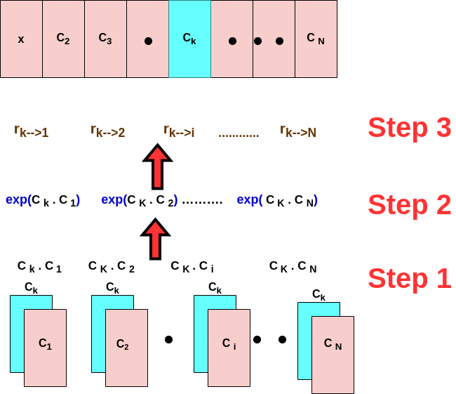
 
The equation is;
 
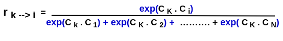
 
Note that r is always positive (because the exponentiate is always +)and a number between 0 and 1!
So till now, we were able to quantify the **relative degree** to which, the Kth word is related to each of the N-words in the sequence! So the more related the Kth word is to any of the words in the sequence, the closer that r to 1 would be(because they all add together) and the more unrelated word are to each other, the closer to 0 would be!
 
## Interpretation of the Relative Similarity
1. Quantify how similar the Kth word is to word i
2. The larger the r, the more degree of correlation!
3. The smaller the r, the less relative they are!
4. This r is a mathematical way to say the relation between words which is gained by the word vectors.
5. The way we gonna learn these relationships is thro **gradient decent**
6. **🔥Headsup:** When we do these inner products between the words in a sequence, they can be done in **parallel computing** because they are independent of each other which means that they can be done simultaneously as they are not related to each other!
The underlying inner product between word K and all the other N-words in our sequence can be performed in parallel!
 
## Summary till now
1. Map the words to their associated vectors
2. Quantify similarity between words via Inner Product
3. Quantify Relative Similarity
4. So now wanna revise or refine the word vectors, why? Ya, remember the Bat 🦇 exp? if yes then recall that the mapping from word K to code K (C k) was done independently of the context in which the Word K is used! So gotta modify the word vectors in a way that takes into account the context of the surrounding words!  **But how? 🤔**
## 👇
We now know that r k---> I represents the relative relationship of word k to a word i. So we gonna use this idea to manifest a refined word vector for the Kth word which takes into account the context of surrounding words!  **But how? 🤔🤨**
 
1. We gonna take those r and multiply them with the word vectors of the words in the sequence (C 1 --- C N): So: r k --->1 * C 1 + r k --->2 * C 2 + ... + r k --->N * C N. (Step 1)
2. Then add these all together after which we gonna take a new representation for the Kth word (~C k) (Step 2)
 
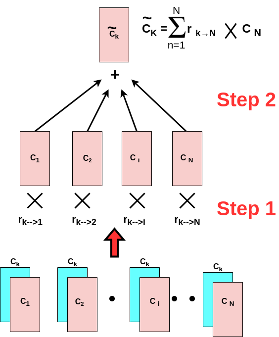
 
## 🔥 Notice:
The thing that I want you to notice here is that;
if Ck is highly related to a particular word in our sequence of N words, then the corresponding relative relation (r) would be **Large** because its highly related, then that Large r is gonna multiplied by the associated code, and therefore that highly related word would contribute significantly to the revised version of the code for word K!
So all in all, we successfully revised or refined the code (word vector) in a way that takes into account its contextual relative relationship to each of the words in the sequence! Now, 👇
 
## Concept of Attention
 
Now the thing that I want you to think 🧠 about is these relational numbers! (r k-->1) What are they telling us?  🤔
 
- They are telling us, whenever we are doing this mapping to ~Ck, **how much attention we should pay to the corresponding Code or word** (C k)!
- if the **relationship is high** (r is high) ---> then pay **high attention** to the corresponding word!
- if the **relationship is small** which means that a particular word is not related to the Kth word, (r is small) ---> then pay **low attention** to the corresponding word!
- The above points are exactly the concept of **Attention 😎**!
👇
**Attention** means how much attention should be paid between word K and the word i for constituting the new representation of word C k which takes into account the contextual relationship of the surrounding words!
 
# Self-attention Mechanism
 
## Vector Transformed with Context
- So thro this attention process, the original naive vector or Ck **transformed** to a new vector ~Ck which takes into account the context of surrounding words! (C k --> ~Ck)
- So that Ck attends to N code to which it is most correlated as implied thro the underlying inner product between word K and all the other words in the sequence!
 
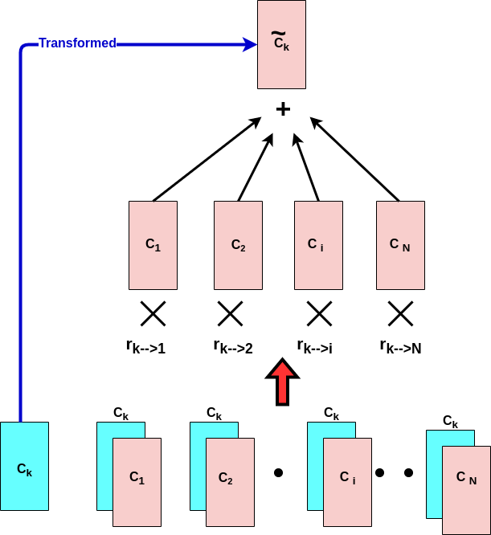
 
## Notational Meanings 🤩
- Ck that we gonna examine all other words concerning, is called **Query**! So we wanna query how related the query Ck is to each of the N-words!
- The N vectors associated with words in our sequence is called **Key**! So the degree to which the query Ck is related to the Keys thro the inner product will quantify how much attention should be paid to the corresponding vector when we construct the updated version of our code (~Ck)!
- Finally **Values** are those relational numbers (r k-->i) multiplied by our original vectors!
 
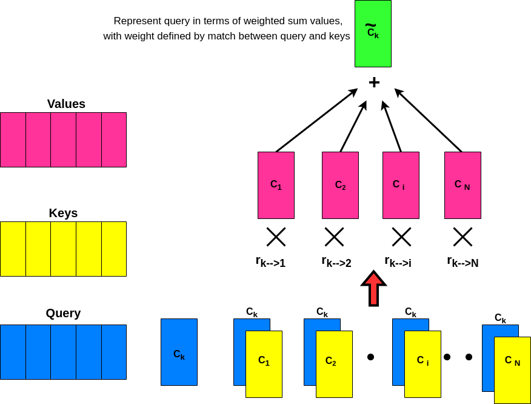
 
So till now, we were able to transform the initial naive vector Ck to a refined vector ~Ck which takes into account the context of the surrounding words!
Then if we do it for one word (left picture), we can do it for **all** the words in the sequence (right picture)! So now ~C1 takes into account the context associated with all other words in the sequence to ~CN!
 
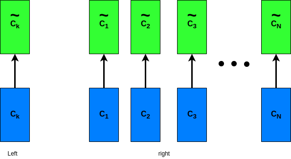
 
**But** as ya may notice, this process is independent of the **Order** of the words! In other words, if we permute or re-order the words in a way that for exp. the last word becomes the first word, the output of this attention process will be the same! It means that the order of the words does not matter in this scenario! However, in the case of our Natural language, the order of the words matters! This is because it affects the contextual meaning!
For example, if we have a sentence like this:
- the United States ----> The word we expect to be after this phrase "United States" is pretty different if there is a gap between "United---gap---states--gap----"!
So we need to modify the current design in a way that takes into account the **order** of the words! But before jumping into this, let's see a quick diagram-look summary of what we've learned so far!
 
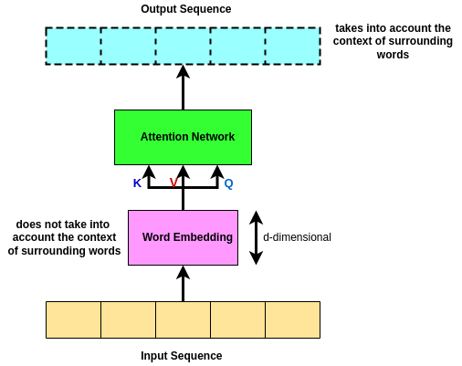
 
But wait! 🤔 Before getting into the solution which takes into account the order of words, let's introduce a new concept called **Skip Connection**!
 
## Skip Connection
So in the original setup (diagram above), when you go from bottom to top (from input to output) when we do the attention network and we get the output sequence, we have lost the original word embeddings at the bottom! So what it does is; it takes the original word embeddings and it skips it above the attention network! Then what we do is we **add** the original word embeddings to the output of the attention network and after we have done this, we normalize them concerning each other!
 
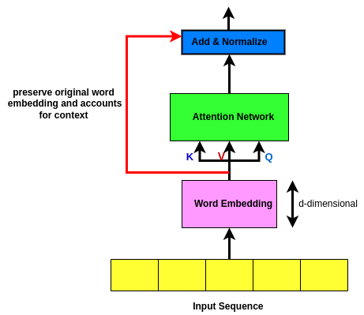
 
## Purpose of Skip Connection
The main goal of Skip Connection is to preserve the original input sequence! 🌱 Ya ask why? 👇 should answer ya!
This is because even with a lot of attention heads, there’s no guarantee that a word will attend to its position! The attention filter can forget entirely about the most recent word in favor of watching all of the earlier words that might be relevant. A skip connection takes the original word and manually adds it back into the signal so that there’s no way it can be dropped or forgotten. This source of robustness may be one of the reasons for transformers' good behavior in so many varied sequence completion tasks! 😎
 
## Positional Embedding
So now is the time to solve the order of words problem!😜
What we need to do is to modify this setup (diagram above) in a way that takes into account the position of words in the sequence!
But before jumping into the detail, let's first see how we can do this!
 
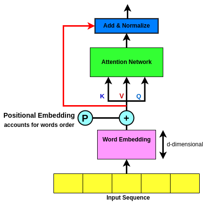
 
So as ya see in the above diagram, the way that this can be done is that we take the input sequence (input sequence) each of which is mapped to a vector (word embeddings), then those word embeddings are gonna be **added** to positional embeddings (P) which is a vector of zeros and ones, and then the rest of the network is unchanged! But the question now is how do we achieve this positional embedding that reflects the positions of the words in the sequence? 🤔
 
You probably are thinking of assigning a number to each word at a given time step so that it can reflect the position of the words in the sequence! So for example number "1" is given to the position of the first word in the sequence, the number "2" is the second word in the sequence, and so on! Can ya then guess what sort of problem it introduces? 🤔
The problem with such an approach is obviously that in case we have a pretty long sentence, the values will get quite large and the network will be very unstable due to training! So we need to do something else!
 
The idea proposed by the original paper is kinda similar yet far more genius! Instead of using a single number to represent the position of words, they used a d-dimensional vector that contains information about a specific position in a sentence. This vector is meant to equip each word with its position in the sentence, which subsequently will be added to our original Word Embeddings! (P in Diagram). So the idea is that we can use this vector to add positional information to the word embeddings, right? But what about the implementation? 🤔
 
The equation for the positional embeddings is as follows:
 
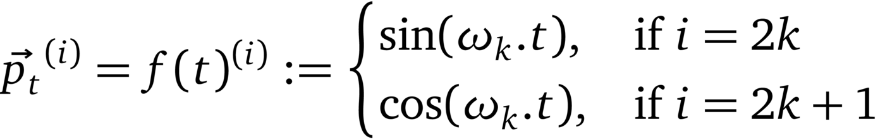
 
where:
 
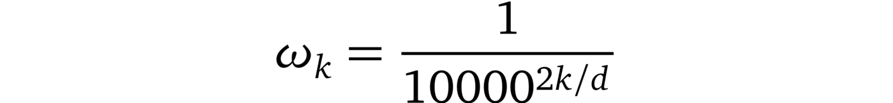
 
Or you can think of it as:
 
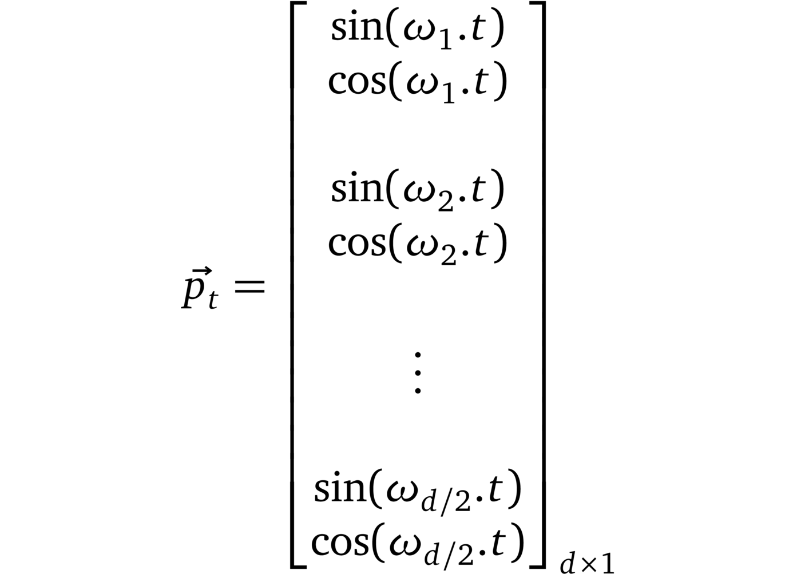
 
But let's see how this is working in practice!
 
Remember that we have a d-component vector as I mentioned this P is a d-dimensional vector?
So let it be represented by 👇 where it is composed of embedding dimension 1, embedding dimension 2, all the way to embedding dimension d!
 
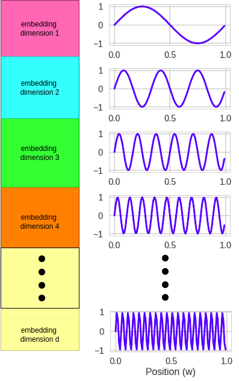
 
Now the thing I want ya to notice is that every of those embedding dimensions will have;
- associated *sin* wave that has its relative frequency based on its position in the sentence!
So, for example, embedding dimension 1 has a relatively low frequency, embedding dimension 2 has also a sin wave but with a quicker frequency, and embedding number 3 has also a sin wave but is faster!
- So the thing I wanna communicate is, as we move from embedding dimension-1 to embedding dimension-d, the frequency at which the sin wave oscillates is connected to the dimension and gets increased as we move down!
- Then what we gonna do is that the value of the positional embedding depends on the position of the word! So along the horizontal axis, is the position of the word! So the idea is that if ya look at a word with a given position in our sequence, you're gonna associate a number for each of the d-dimensions of that embedding! The number is gonna be connected with the associate sin wave at that dimension!
So if you think about it, the **position** for the d-dimensional vector that is gonna be associated with each of the words in our sequence will depend upon the position/order of that word in the sequence!
 
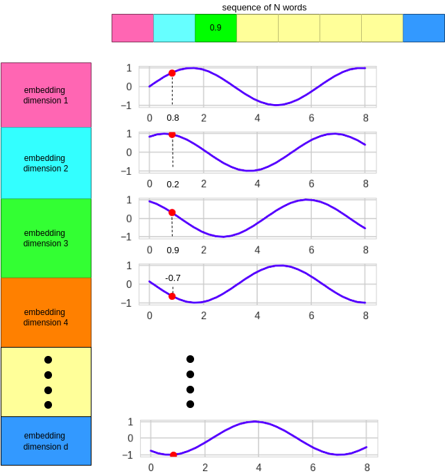
 
## Positional embedding All in One
So the position of the words is meant to be reflected from left to right along the horizontal axis! So it meant to be the first word, second word, third word, and so on! And then depending upon where the word is, we will pick off the corresponding sin wave at each of the d- components of the embedding!
 
So the key 🔑 point to take from this mechanism is to understand that each of the N-words in our sequence is gonna be encoded in a d-dimensional vector which reflects the position of the word in the sequence! So this way we encoded positional information of each word thro this PE mechanism! However, this use of Sine Wave connected with the frequency is not the only way to do this! There are lots of other ways to find the position/order of words in a sequence which is beyond the scope of this article! But the Sine Wave approach is a standard way and it proved to be pretty effective!
 
## ⁉️🧠 Why positional embeddings are summed with word embeddings instead of concatenation?
 
The risk of adding positional embedding to the word embeddings is mixing up information! So of course, ppl have to think abt Concatenation! The advantage of the Concatenation approach is that by using Concatenation, each of the positional embedding and word embedding which carries the semantic information, have their own space so there is no risk of mixing up the information! However, the downside of the Concatenation approach is that it requires pretty much more memory! So this approach comes with a relatively large cost of having stronger GPUs to store all those large and heavy vectors!
Thus, I pretty much think that there is no winner among these two approaches and the choice really depends on the application!
 
## Overall Network Architecture
 
If we look back to our initial design, we can see that we now have taken into account both the meaning of the words and the positional/order information of the words thro positional embeddings which is achieved thro d-dimensional vectors of each of the N words in the sequence!
So we now have the meaning of the word plus the position of the words!
However, these meanings does not take into account the context of the words! So that's the intuition beyond the attention network!
But I want you to notice here that the words that are positionaly nereby eachother will potentially have similar positional embedding, therefore their inner product will be high! In contrast, the words that are far apart will have different positional embedding, therefore their inner product will be low!
 
Then finally we need to start to learn these vectors thro our network on a large corpus of text! This learning process is gonna be don thro a simple **Feedforward Neural Network** at the top that I'm not gonna get to detail of it. Becasue I'm pretty sure anyone reading this article have a fairly good understanding on how that Neoral Network learn vectors thro a forward and update step via gradient descent! We then use a skip connection and add and normalize!
 
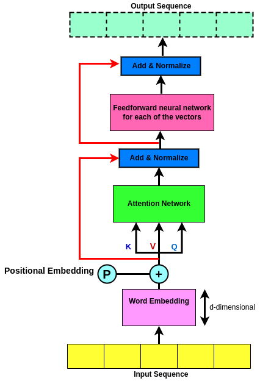
 
# Sequence Encoder
 
Let's recap the so-called Transformer network!
1. As discussed thro this article, in the very initial step we have N naive word embeddings that does not take into account niether the meaning of the surrounding words, nor the order of words! Therefore we need to modify them in a way that it acconts for both!
2. So we introduce Position Embeddings to account for the positions of the word!
3. Introduce the attention network which takes into account the context of the words! And since it has been found convinent to not loose the original word vectors so we use a skip connection!
4. Intorduce a Feedforward Neural Network to learn the meaning of the words! But why? 🤔
   - The first reason is that thro the process of Neural network we provide **regularization** or **structure** on this network! Tis
   - In terms of mathematics, what it does is restricting the output of the neural network to be constrained to the subspace associated with the vectors of the network which tend to improve the performance!
   - tanh restricts the output of the network to be between -1 and 1!
 
By going thro all of the above steps, we were successfully able to Encode a sequence! And if we did it one time, there is no reason to not doing it K time! Where in practice K is 3 or 6! So we can repeat the process K time which possibly makes it a **Deep Sequence Encoder** that tend to improve performance!
 
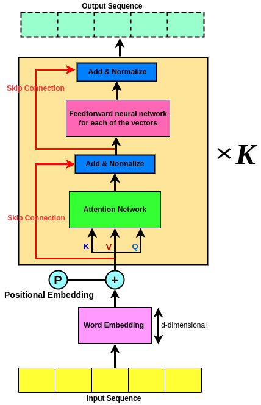
 
# Coupling Sequence Encoder to Decoder
 
Thus far we have talked about Sequence Encoder and the way it work for predicting the next word in the sequence!
But imagine a setuation where we not only wanna predict the nxt word but we wanna predict the next **sequence of words**! not just one word!
Take Traslation from one language to another as example!
So here we gotta not only decode the original sequence but also we need to decode it to another language and try to understand the same architecture in another language, right?  So as an example, consider "the orange cat is nacho" in English and ya wanna traslate it into English!
 
So based on what we've learnt so far till now, we first need to Encode this sequence, the process with respect to diagram above in Sequence Encode Section will be sth like this;
 
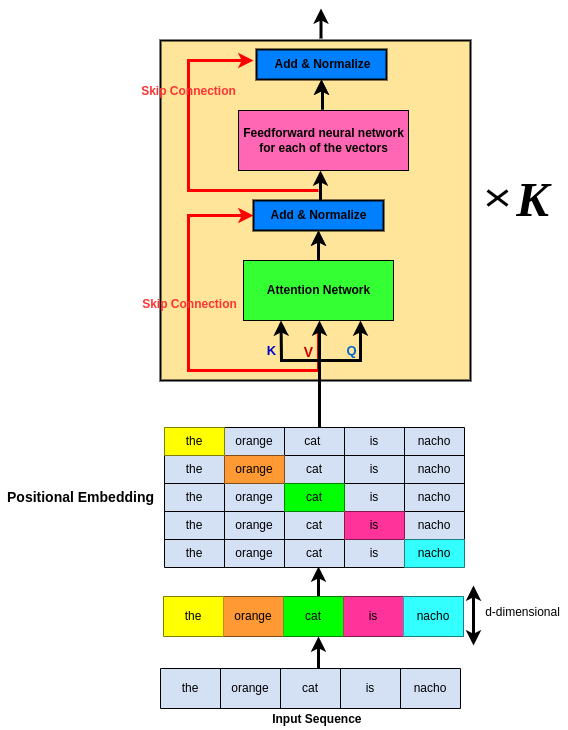
 
So now we have encoded our sequence, but say we wanna convert it to another language (e.g. French), if so, then gotta Decode it to the target language, right?
 
So the way we're gonna do that Decoding for the entire sequence, we will do it by sth (2) which have alot incommon with what have learnt so far (1)! So I'm gonna go thro the right step by step for ya to understand the logic!
 
## Encoder-Decoder
 
The mixed of Sequence Encoder to Decoder is shown in picture below; Take a look at it, think 🧠 for a sec then come and read below for further explanation!
 
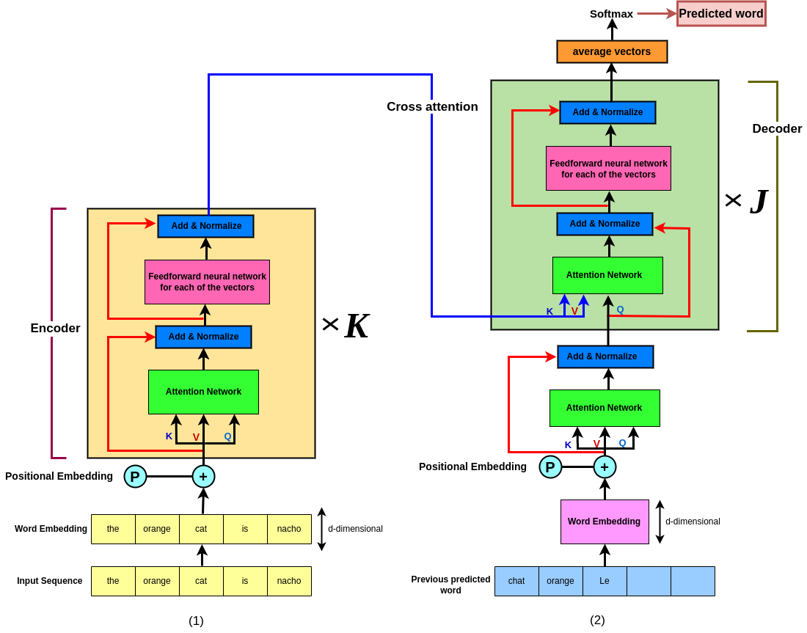
 
So at the bottom is the words that have been predicted by the decoder so far!
What we're gonna do is we gonna take the last word that we predicted and use it as the input to the decoder then produce the french version one word afte the other!
 
So for example imagine we have predicted "the" and "orange" in french so far (M words)! So at the bottom, there are the M words that have been predicted so far!
So till now, on the left (lime box) is the original sequence and on the right (blue box) is the sequence that we have predicted say in french so far!
 
Now in the same concept, remember that I introduced repeatition of *K* to produce a deep network? Well if we did it for this side, then there is no reason to not doing the same for the left (decoder side)as well! So on the right we gonna do in *J* times!So we have a repeatition of *k* times on the left and *J* times on the right, right? So this is called a **deep architecture network**!
 
So the thing that I wanna ya to **🔥notice** here is that the **input** at the right are the words that have been predicted as far! And the way we're gonna do that is the **most recently predicted word** locates to left in first cell(orange) then the second most recent predicted word is in the second cell (le)! So the left most word is the most recently predicted word and the further to the right are the words that have been predicted in a while!
 
So the idea is every time we predict a new word, that input sequence on right(2) **get shifted** to the right by one position then the new word goes to the most-left position! So the input on the right, is always shifting to the right as we predict new words!
 
# Decoder Interpretation
- Output sequence are the previous decoded words!
- Embedded words will represent any language codebook!
- Attention network on the output sequence accounts for the context!
- Output of the Encoder will be the Keys and Values for the attention network of the Decoder! And the Query is comming from the bottom! (**Cross Attention**)
- Employ attention of the final embedding of the input sequence!
- Then lastly thro the **Softmax** layer we get the next prediction based on the left-most word! But wait....
 
# ⁉️🧠 Why Softmax?
 
Using softmax have some strong benefits!
1. It helps to force the attention network output result fall between 0 and 1. In other words, it forces all the values to lie in [0, 1] attention range!
2. It helps to emphasize the highest value, while agressively squashing the smallest! This means that if one word scores higher than the others by far, softmax will make it look like an argmax, with the winning value close to one and all the others close to zero. So this way the model the winner word is the one which probability is close to 1!
 
# Cross Attention 🔀
 
So at the top of our Encoder we will get an output sequence of M d-dimensional vectors corresponding to the original M input words!
Now these M vectors are the **Values** and the **keys** for the attention network of the Decoder!
Then the decoded sequence (output sequence at the bottom decoding network) is the **Query** for the attention network of the Decoder!
So if we have decoded N words up to this point (Q) then we possibly have N d-dimensional vectors corresponding to the N words that we have decoded thus far!
 
So the reason this is callled **Cross Attention** is because of the keys and values are coming from the M words that have been encoded at the top of our Encoding network then the Query is coming from the N words that have been decoded thus far! So cross attention is used because the keys, values, and queries are coming from different sources! (1)
 
So whenever we do such architecture, we then get a new encoding of the **d-dimensional N Vectors** at the end of queries which represents a new sequence of N words! (2)
 
So what's happening here is that the N-words that have been decoded thus far are represented as the **Values** and **keys** via the attention mechanism which are at the top of the encoding of the input sequence! And so this is called **Cross Attention**! (3)
 
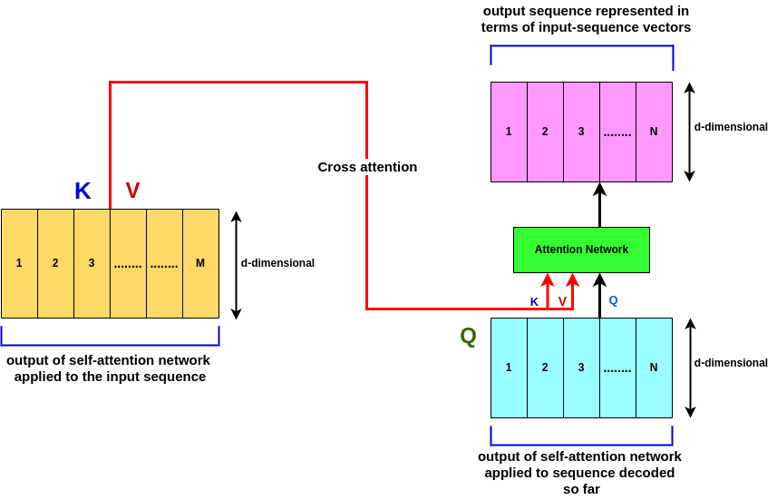
 
# Multi-head Attention
 
## Ways that Attention is manifested 🥸
 
- **Self Attention**
- **Cross Attention**
- **Multi Attention**
 
## Multi-head Attention
 
## ⁉️🧠 Why Multi-head Attention?
 
Ya, remember I mentioned putting softmax at top of our network would help to force the output falls between[0,1]? But such approach has one big downpoint! That is it will tend to focus on a single element which is a big limitation! **Ya ask why⁉️** Because we should keep several of the preceding words in mind when predicting since the overall target is to predict the potential next sequence of words, and the softmax just robbed us of that! This is a problem for the model.The solution to this problem is to have several different instances of attention/heads running at once! This lets the the transformer consider several previous words simultaneously when predicting the next set! And that's the intuition beyond using multi-head attention!
 
## What is Multi-head Attention? 🤔
 
Multi-head attention is basically a generalization of the Attention Mechanism that we've seen before! (refer to the Notational Meaning-- Attention Mechanism)!
 
So what we would do now is introduce a Functional form for the Attention Mechanism which says that Attention is a function of the Query *Q*, Keys *K*, and Values *V*, right? **😉**
 
`output = Attention(Q, K, V)`
 
So as we discussed earlier, the Query, Keys, and Values all are d-dimensional vectors!**(1)** So now, if we consider the ith query or the ith one of these n vectors (1), what we're going to do is do a projection, what we call a projection of that query qi (qi is a vector, it's d dimensional and it corresponds to the ith one of those n vectors, 1, 2, N),  we're going to multiply that vector qi which is d-dimensional, times a matrix, where the matrix is composed of K rows, each of which is also d-dimensional. **But wait...🤔 Why Projection⁉️**
 
implementing such a multi-head architecture increases the computational load!**🤦‍♀️** Computing attention was already the bulk of the work, and we just multiplied it by many heads we want to use, ain't it crazy? **🤯** To get around this, we use the trick of projecting everything into a lower-dimensional embedding sub-space. This possibly shrinks the matrices involved which dramatically reduces the computation time! The day is saved! **😁☀️**
 
So what we're doing thro this ***Projection*** is;
1. we're taking each of the rows of the matrix MQ, so MQ is a matrix M that is operating on a query q. So this M Q, is a query matrix, right?
2. Then we're taking the query qi, and take an inner product of qi with k vectors, each of which corresponds to the rows of the matrix that you see in (1--yellow), and map it onto what we call a linear subspace, which is spanned by the k rows of the matrix MQ.(2)
 
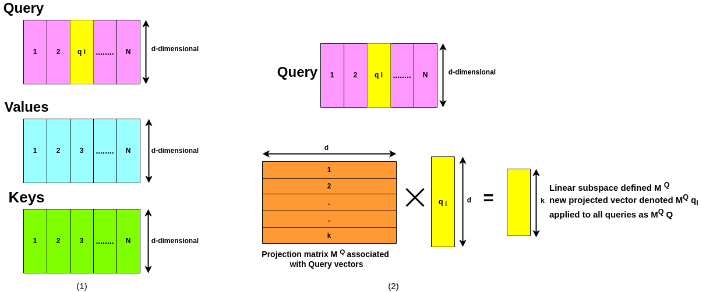
 
## Recall 🧘‍♀️🧘‍♂️...
 
Do ya recall our Paris🗼 example? where the embedding vector that is associated with each word, had topical meaning and then each of the components of that vector represents a topic, and if the word Paris🗼, is aligned with that topic, the associated component is positive. So for example, Paris is the capital of France, and it has political significance. So the second component which notionally is associated with politics is positive, on the other hand, Paris doesn't have that much to do with gender, so you see that the first component associated with sports is slightly negative! So you recall this is the intuition that underlies the word vectors!
 
## Intrepretation
 
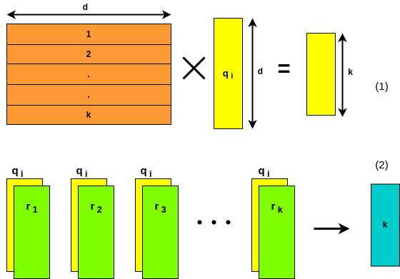
 
Now, remember that each of the queries corresponds to a vector associated with a particular word, and remember that each of the components of that vector represents topics? (1) So the way that we can think about this, is that we're taking the query q, and we're taking an inner product of qi here with r1, r2, all the way to rk rows of the matrix MQ (2) and project it onto the k rows of this matrix MQ! In other words, each of the k rows of the matrix MQ represents, what we call **meta-topics**!
 
So what's happening is that each of the rows of that matrix, is selecting or emphasizing some of the components of the query vector qi, and essentially by using this matrix, we're highlighting certain topics or meta-topics that are important for the prediction or analysis purpose!
 
So this summarizes that this matrix MQ (orange), which is composed of k d-dimensional rows, is mapping the original query  d-dimensional vector qi, to a new vector which is k-dimensional! Now, those k dimensions of the new vector represent what we will call meta-topics of the original vector! So this is a general concept and task that oftentimes happen, this idea of multiplying the query times a matrix, and so doing, highlighting k meta-topics associated with that vector! **🤩**
 
## h Projection "heads" 🤩
 
Now, as we've talked about projection, what this is doing is mapping the **original d-dimensional vector q_i** which corresponds to all of the d topics that can be characteristic of a word, to **meta topics**, where each meta topic is characterized by one of the rows of the matrix, where each row, the weighting of the components of each row highlight particular topics associated with the word embedding factor! (1)
 
Now, if we can do this projection scenario one time with one particular matrix(M_i), then we can potentially do this h times, can't we? **😜** So what we can do is we can take the original vector (the original query q_i), and we can multiply it times M_1, M_2 through M_h, where we have h different types of projection matrices of this form! (2) So by doing this, we're taking the original vector q_i and mapping it onto *h* different linear subspaces which are defined by the corresponding matrix!
So what is happening thro these matrices, M_1, M_2 through M_h, is that by each of them individually we are highlighting different subspaces, i.e. different sets of meta topics associated with the original word vector here q_i! In other words, thro these matrices M_1 through M_h, we're highlighting particular aspects or topical characteristics of particular words, crazy, right? **🤩**
 
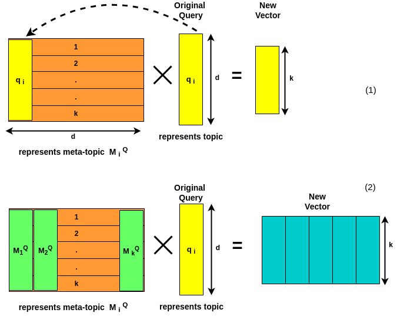
 
So if we did it for queries, then obviously we can do the same thing for the keys and values!
 
So M_Q corresponds to a projection matrix for the queries. M_K corresponds to a projection matrix for the keys and M_V corresponds to a projection matrix for the values! We can do this multiple times, in other words, we can have h different matrices, h different matrices for the queries, h different matrices for the keys, and h different matrices for the values. Hereby M_i, I mean the ith example of them!
 
So what we're doing by this projection, in each case for the queries, the keys, and the values, we take the original sequence of n vectors, each one of which is d-dimensional then after this projection, we map those n vectors to a new sequence of n vectors, each of which is k-dimensional!
 
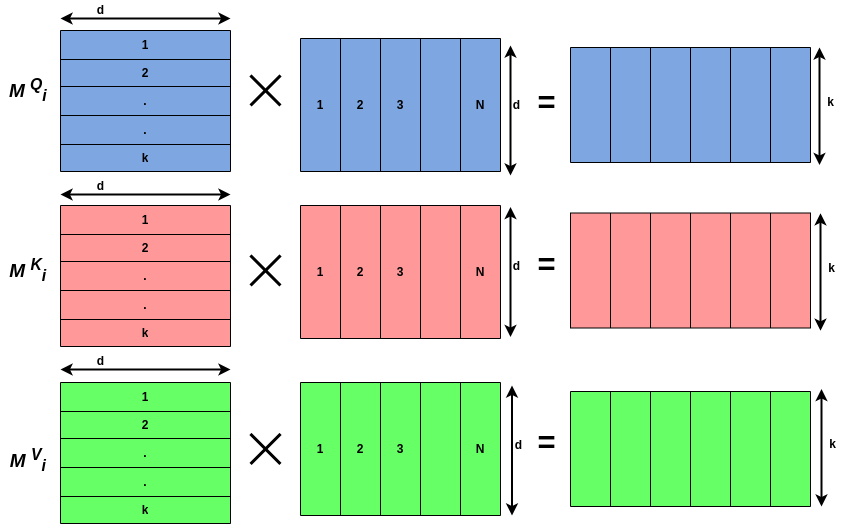
 
So if get back to our functional representation of our Attention, then we would update it like this;
 
`output i = Attention(Mik K, Mik V, Mik Q)`
 
So now recall that the output for the ith instantiation of the matrices is repeated? We can do this h different times for h different manifestations of those matrices and therefore we get output 1, output 2 through output h of these different attention mechanisms. We then take those output vectors, we just stack them one after the other, that's called concatenation so the concat means concatenation. So what we're doing is we're taking output vector 1, the next vector output 2, then output 3 through output h, we just stack them all together. That's called concatenation. Then we do what's called a linear transformation through the matrix WO, which corresponds to the output, and then this is the final output of the multi-head attention!
 
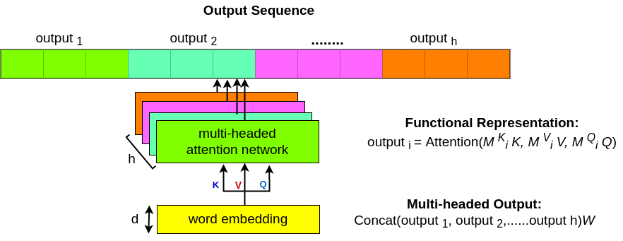
 
Below the original diagram from the Attention paper is attached.
 

 
And the multi-head attention diagram from the paper;
 
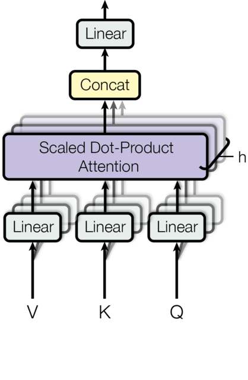 