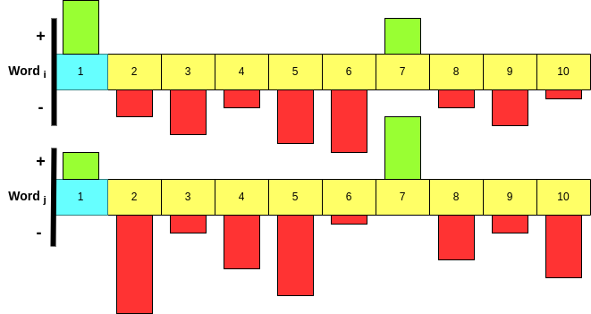

# transformer-network

1. word embedding concept
    - word mapping
    - word to vector
    - Conceptualization of Word Vectors
    - Relationhip between word vectors
2. Inner product
    - Accounting for word context
    - Why inner product
    - exponential function
3. Attention Mechanism
4. 

# 1. Introduction to word embedding concept

Before deep diving into Transformers 🤗 we need to get familiar with a basic concepts of word embedding! So, the idea is very simple; Word Embedding means that every word in our vocabualry is gonna be mapped to a vector!

In order to understand the concept of word embedding, let's just think of map of globe 🌎! So what I'm showing in the following map is several different squres🟥, triangles🔺, and circles 🟣 (i.e location 📍). What I wanna convey thro this, is the fact that the reigons which are geographocally close to each other, have similar characteristics and very different characteristics from the ones that are far away from each other! So for example, we expect that the people, culture, lifestyle, etc of the people in Asia (circles 🟣🟣) are similar to each other but very different from ones in North America (squres 🟥🟥)!

So if we think of it from a math viewpoint by considering the lantitude and longitude lines(2D space), we can come up with the following idea:
- if 2 points have similar lantitude and longitude lines, then we would expect that they are very close to each other!
- Whereas if the associated lantitude and longitudes of 2 points is very different, then we would expect that they are far away from each other!
So, we have a concept of **Similarity** manifested thro **Proximity**!

So we will think and look similarily to the Word Embedding concept! So 👇;
1. So every vocabulary word is gonna be mapped to a point in 2D space!
2. then the closer the two words are, the more **related or synonymous** they are!
3. and the farther the two words are, the more **dis-similar or non-synonymous** we would expect them to be!

## Word Mapping
So pretty coceptially we can think of it as having a vocabulary of `V` words(i.e. V1, V2, V3,..... V), then think of mapping each word to a 2D space in longitude and latitude! So the way we would like to do this is to **Learn** this 2D vectors of the words in sucha way that if 2 words are similar to each other, we would want their assosiated longitude and latitude to be near to each other and vica versa!

So this concept is the very fundumental block that we need to model our natural language! 
But the key 🔑🗝️ here to notice is that words are **not numbers**! they are not in form of numbers! So, whenever we wanna do modeling of Natural Language, this modeling is achieved by **Algorithms** that potentially can work with numbers! So, what we need to achive is a mapping of each word to a number, once achieved, we can do the analysis! So the way we gonna do this is map or relate every word in our vocabulary to a vector that may be more than 2D! And the idea is when the words are similar, they should be near to each other in this vector space and whenever they are unrelated they gotta be far from each other! And whithin the concept of **Learning**, we will learn the mapping of every word to a vector! And there are many ways to do this!

## Word to Vector(word2vec)

Each of the vectors associated with the given words is often called **Embedding**! So the idea of embedding is to map the words to a vector or to embed a word in a vector space!

So the idea is basically mapping each and every word to a vector!

So now imagine we have a sentence consists of several words sequentially followed by each other! Then this means, we need to map each word to a vector! So, in the below example, C1 is the vector associated with the first word and so on! The way we learn sucha thing is gonna be discussed later in this article!

But what I want you to achieve from here is that;
1. C(i) is the vector associated with the word(i)! Each of the C(i) is a D-dimensional vector!
2. If two words are similar, then we would expect their associated vectors to be nearby/close to each other!
3. Then we gonna learn those vectors from C(1) to C(n) based upon a large corpus of text! So the idea of this learning concept is to achieve proximity of the words to each other!
4. Once we have achieved this codes, then we would have codebook composed of all the vectors associated with the words!
5. Then once we get such codebook then we are ready to start our analysis process with the associated algorithms! Since now we have numbers(vectors) that are well enough to do the mathematical analysis! Look at the example below;

The key 🔑 idea in all of these methods is that, for each word in a given document, we should be anle to **predict the presence of the surrounding words**! So, the idea is that, the words have meaning, that meaning implies at a given word, that should indicate particular other words is present in surronding with high probability! So **Word Vectors** which we gonna learn is meant to preserve that concept!  So with that being said, let's see the **Conceptialization of Meaning of Word Vectors**!

## Conceptualization of Word Vectors
Let's assume the following picture to be a assosiated meaning of the word vector! Then let's consider a 10-dimensional word vector which basically represents the meaning of the word! and each of these 10 dimensions are associated with a particular meaning! With this then we can say;
1. Each of these 10 components are associated with a particular meaning which can be viewed as a "topic"! If so, then each of these topics represents the characteristics of the word!
2. If a given word is aligned with the ith component then we would expect the corresponding value of ith element to be positive becuase it aligned with the word!
3. If a given word is not aligned with the ith component then we would expect the corresponding value of i to be negative becuase it is not aligned with the word!

So just notinaly let's look at a word as an example to better understand the concept! So here, I am assigning the "topics" or "themes" to that 10-dimensional vector which gonna be learnt thro our network! Look at the word "Paris" and the vector associated with it below;

If you look at the word "politics" since politics have had a significant role in the history of Paris, so it aligns with the "paris" word. Consequently, the value of "politics" component/topic is positive! Conversely, if you look at the word "gender" it has nothing to do with paris so the the value of "geder" component/topic is negative!

So the idea that I want ya to gather from this is that, what that word vector is doing, is represnting component by component(+ if aligned with the word and - if not aligned with the word) is providing the **underlying themantic of the word**! So, what we gonna do next is to take this **underlying themantic of the word** to form a new natural language processing modeling!

# 2. Inner Product 

## Accounting for word context
Now that we understand the concept of word to vector and the intuition beyond it, let's move forward and generalize same concept to a sequence of words!
So based on our current knowledge, in order to get the words ready for further mathematical analysis and modeling, we map each word to a vector of d-dimensional!

## But... 😏😐
As you probably notice, this way of mapping each word to a single vector is pretty restrictive! Because, if you look at dictionary, word in different context has different meanings! 

So the fact of mapping each word to **one single vector** in a sense that I explained earlier, sounds pretty restrictive! Becasue it does not take into account the surrounding words context! So what we wanna do now, is building a framework by which, we can modify this mappings in a way that takes into account the meaning of surrounding words!
To do that, we need to first get familiar with the concept of **Inner Product**! 

Thus far, in the above paragraph, I mentioned that within the concept of word2vec, we map each word to a vector of d-dimensional! Where each of those d-dimensional vectors are associated with a particular meaning/topic!

 

## Introducing the inner product of two codes
So, the idea of inner product is to take the dot product of two vectors! The purpose of inner product is to **quantify the relation/similarity between words**! So, let's look at the below example;

 

So here we have two vectors, C1 and C2, each one of each has d-components! So we gonna take the first d-component of C1 and the first d-component of C2 and then multiply them together all the way for all the d-components! After that we sum all together which is the concept of inner product! So this **inner product** is gonna;
1. quantify **how similar C1 is to C2**
2. So **if W1 and W2 are similar then we would expect the coresponding C1 and C2 to be similar**! Because as we discussed eairlier, each of the components of C1 and C2 represents the underlying meaning of the word!
3. And **if C1 and C2 are similar then the inner product is gonna be positive and large!** (see below to figure why!)
4. If **C1 and C2 are not similar then the inner product is gonna be negative and small**!

## Why the dot product is gonna positive and large if the two words are similar?
Do ya remember the my notinal example of Paris? So now imagine we have two **similar** words; word1 and word2 which has 10-dimensional vector associated with them (just for simplicity, in practice the dimension can get up to 256!). When we say these words are **similar** then we know that their associated vectors gonna be similar, right? If yes, then it means that each of the component of ther vector are similar(being either + or -)! So for example in below picture, because these two word vectors are similar, then as you see both of the componects 1 are positive! 

 

Then if you remember, **inner product** would take component by component and multipy them together! So if the components of C1 and C2 shares similar signs (+ and + or - and -) then the inner product of them gonna be possitive and large, right? then if sum all these positive values we would endup a large positive number, right? 
Similarly if two words are dissimilar then it means that the component of their associated vectors **do not** have similar signs(i.e. + and - or - and +) and hence the multiplication of the components then the sum will be negative and small, right? 
So this exactly why when we say that the inner product is gonna be **positive and large** if the **two words are similar**! 😎

## But... 😐
In the concept of Machine Learning, it's not pretty convenient to work with dot products or values that are sometimes +(for similar words) and sometimes -(for dissimilar word), right? 
To solve such problem, we gotta remind ourselves of the lovely **exponential function**! 

 

So here the X-asis is the input and Y-asis is the output of the function! The most important point to get out of this equation is;
1. For every value of X the exponential function is gonna be Positive! So this means the more positive value of X, the **larger** the exponetial function(Y). 
2. The more negative value of X, the smaller the exponetial function(Y). 
3. The exponetial function is called a **monotonically** increasing function of the input X. 
4. And remember that the inner product of positive and large represents the words that are align and similar! Conversely, the inner product of negative and small represents the words that are dissimilar!
5. The output of the exponential function is always larger if the input is larger! E.g. If ya give me two values of + and -, the exponential output of the positive value is gonna be much larger than the negative input! So the exponetial function preserve the meaning of positive and negative input, however the out put is always positive! **So....**

 

## So:
1. If two words are similar, then the exponentiation of the inner product between those words will be large!
2. If two words are dissimilar, then the exponentiation of the inner product between those words ar gonna be large!
3. This exponentite preserves the meaning of words as represented by inner product!
4. We chose this exponential function because the output is always positive which is convinent to work with in the concept of ML.