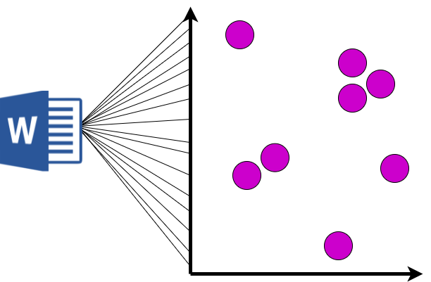

# transformer-network

1. word embedding concept
    - word mapping
    - word to vector
    - Conceptualization of Word Vectors
    - Relationhip between word vectors
2. Inner product
    - Accounting for word context
    - Why inner product
    - exponential function
3. Attention Mechanism
    - Relative Similarity
    - Concept of Attention
    - Vector Transformation
4. Self-attention diagam
    - Skip Connection
    - Positional Embeddings
    - Positional Embedding in action
    - Overall architecture
5. Sequence Encoder
    - Encoder
6. Coupling Sequence Encoder to Decoder
    - Decoder
    - Decoder Intepretation

# 1. Introduction to word embedding concept

Before deep diving into Transformers 🤗 we need to get familiar with a basic concepts of word embedding! So, the idea is very simple; Word Embedding means that every word in our vocabualry is gonna be mapped to a vector!

In order to understand the concept of word embedding, let's just think of map of globe 🌎! So what I'm showing in the following map is several different squres🟥, triangles🔺, and circles 🟣 (i.e location 📍). What I wanna convey thro this, is the fact that the reigons which are geographocally close to each other, have similar characteristics and very different characteristics from the ones that are far away from each other! So for example, we expect that the people, culture, lifestyle, etc of the people in Asia (circles 🟣🟣) are similar to each other but very different from ones in North America (squres 🟥🟥)!

So if we think of it from a math viewpoint by considering the lantitude and longitude lines(2D space), we can come up with the following idea:
- if 2 points have similar lantitude and longitude lines, then we would expect that they are very close to each other!
- Whereas if the associated lantitude and longitudes of 2 points is very different, then we would expect that they are far away from each other!
So, we have a concept of **Similarity** manifested thro **Proximity**!

So we will think and look similarily to the Word Embedding concept! So 👇;
1. So every vocabulary word is gonna be mapped to a point in 2D space!
2. then the closer the two words are, the more **related or synonymous** they are!
3. and the farther the two words are, the more **dis-similar or non-synonymous** we would expect them to be!

## Word Mapping
So pretty coceptially we can think of it as having a vocabulary of `V` words(i.e. V1, V2, V3,..... V), then think of mapping each word to a 2D space in longitude and latitude! So the way we would like to do this is to **Learn** this 2D vectors of the words in sucha way that if 2 words are similar to each other, we would want their assosiated longitude and latitude to be near to each other and vica versa!

So this concept is the very fundumental block that we need to model our natural language! 
But the key 🔑🗝️ here to notice is that words are **not numbers**! they are not in form of numbers! So, whenever we wanna do modeling of Natural Language, this modeling is achieved by **Algorithms** that potentially can work with numbers! So, what we need to achive is a mapping of each word to a number, once achieved, we can do the analysis! So the way we gonna do this is map or relate every word in our vocabulary to a vector that may be more than 2D! And the idea is when the words are similar, they should be near to each other in this vector space and whenever they are unrelated they gotta be far from each other! And whithin the concept of **Learning**, we will learn the mapping of every word to a vector! And there are many ways to do this!

## Word to Vector(word2vec)

Each of the vectors associated with the given words is often called **Embedding**! So the idea of embedding is to map the words to a vector or to embed a word in a vector space!

So the idea is basically mapping each and every word to a vector!

So now imagine we have a sentence consists of several words sequentially followed by each other! Then this means, we need to map each word to a vector! So, in the below example, C1 is the vector associated with the first word and so on! The way we learn sucha thing is gonna be discussed later in this article!

But what I want you to achieve from here is that;
1. C(i) is the vector associated with the word(i)! Each of the C(i) is a D-dimensional vector!
2. If two words are similar, then we would expect their associated vectors to be nearby/close to each other!
3. Then we gonna learn those vectors from C(1) to C(n) based upon a large corpus of text! So the idea of this learning concept is to achieve proximity of the words to each other!
4. Once we have achieved this codes, then we would have codebook composed of all the vectors associated with the words!
5. Then once we get such codebook then we are ready to start our analysis process with the associated algorithms! Since now we have numbers(vectors) that are well enough to do the mathematical analysis! Look at the example below;

The key 🔑 idea in all of these methods is that, for each word in a given document, we should be anle to **predict the presence of the surrounding words**! So, the idea is that, the words have meaning, that meaning implies at a given word, that should indicate particular other words is present in surronding with high probability! So **Word Vectors** which we gonna learn is meant to preserve that concept!  So with that being said, let's see the **Conceptialization of Meaning of Word Vectors**!

## Conceptualization of Word Vectors
Let's assume the following picture to be a assosiated meaning of the word vector! Then let's consider a 10-dimensional word vector which basically represents the meaning of the word! and each of these 10 dimensions are associated with a particular meaning! With this then we can say;
1. Each of these 10 components are associated with a particular meaning which can be viewed as a "topic"! If so, then each of these topics represents the characteristics of the word!
2. If a given word is aligned with the ith component then we would expect the corresponding value of ith element to be positive becuase it aligned with the word!
3. If a given word is not aligned with the ith component then we would expect the corresponding value of i to be negative becuase it is not aligned with the word!

So just notinaly let's look at a word as an example to better understand the concept! So here, I am assigning the "topics" or "themes" to that 10-dimensional vector which gonna be learnt thro our network! Look at the word "Paris" and the vector associated with it below;

If you look at the word "politics" since politics have had a significant role in the history of Paris, so it aligns with the "paris" word. Consequently, the value of "politics" component/topic is positive! Conversely, if you look at the word "gender" it has nothing to do with paris so the the value of "geder" component/topic is negative!

So the idea that I want ya to gather from this is that, what that word vector is doing, is represnting component by component(+ if aligned with the word and - if not aligned with the word) is providing the **underlying themantic of the word**! So, what we gonna do next is to take this **underlying themantic of the word** to form a new natural language processing modeling!

# 2. Inner Product 

## Accounting for word context
Now that we understand the concept of word to vector and the intuition beyond it, let's move forward and generalize same concept to a sequence of words!
So based on our current knowledge, in order to get the words ready for further mathematical analysis and modeling, we map each word to a vector of d-dimensional!

## But... 😏😐
As you probably notice, this way of mapping each word to a single vector is pretty restrictive! Because, if you look at dictionary, word in different context has different meanings! 

So the fact of mapping each word to **one single vector** in a sense that I explained earlier, sounds pretty restrictive! Becasue it does not take into account the surrounding words context! So what we wanna do now, is building a framework by which, we can modify this mappings in a way that takes into account the meaning of surrounding words!
To do that, we need to first get familiar with the concept of **Inner Product**! 

Thus far, in the above paragraph, I mentioned that within the concept of word2vec, we map each word to a vector of d-dimensional! Where each of those d-dimensional vectors are associated with a particular meaning/topic!

 

## Introducing the inner product of two codes
So, the idea of inner product is to take the dot product of two vectors! The purpose of inner product is to **quantify the relation/similarity between words**! So, let's look at the below example;

 

So here we have two vectors, C1 and C2, each one of each has d-components! So we gonna take the first d-component of C1 and the first d-component of C2 and then multiply them together all the way for all the d-components! After that we sum all together which is the concept of inner product! So this **inner product** is gonna;
1. quantify **how similar C1 is to C2**
2. So **if W1 and W2 are similar then we would expect the coresponding C1 and C2 to be similar**! Because as we discussed eairlier, each of the components of C1 and C2 represents the underlying meaning of the word!
3. And **if C1 and C2 are similar then the inner product is gonna be positive and large!** (see below to figure why!)
4. If **C1 and C2 are not similar then the inner product is gonna be negative and small**!

## Why the dot product is gonna positive and large if the two words are similar?
Do ya remember the my notinal example of Paris? So now imagine we have two **similar** words; word1 and word2 which has 10-dimensional vector associated with them (just for simplicity, in practice the dimension can get up to 256!). When we say these words are **similar** then we know that their associated vectors gonna be similar, right? If yes, then it means that each of the component of ther vector are similar(being either + or -)! So for example in below picture, because these two word vectors are similar, then as you see both of the componects 1 are positive! 

 

Then if you remember, **inner product** would take component by component and multipy them together! So if the components of C1 and C2 shares similar signs (+ and + or - and -) then the inner product of them gonna be possitive and large, right? then if sum all these positive values we would endup a large positive number, right? 
Similarly if two words are dissimilar then it means that the component of their associated vectors **do not** have similar signs(i.e. + and - or - and +) and hence the multiplication of the components then the sum will be negative and small, right? 
So this exactly why when we say that the inner product is gonna be **positive and large** if the **two words are similar**! 😎

## But... 😐
In the concept of Machine Learning, it's not pretty convenient to work with dot products or values that are sometimes +(for similar words) and sometimes -(for dissimilar word), right? 
To solve such problem, we gotta remind ourselves of the lovely **exponential function**! 

 

So here the X-asis is the input and Y-asis is the output of the function! The most important point to get out of this equation is;
1. For every value of X the exponential function is gonna be Positive! So this means the more positive value of X, the **larger** the exponetial function(Y). 
2. The more negative value of X, the smaller the exponetial function(Y). 
3. The exponetial function is called a **monotonically** increasing function of the input X. 
4. And remember that the inner product of positive and large represents the words that are align and similar! Conversely, the inner product of negative and small represents the words that are dissimilar!
5. The output of the exponential function is always larger if the input is larger! E.g. If ya give me two values of + and -, the exponential output of the positive value is gonna be much larger than the negative input! So the exponetial function preserve the meaning of positive and negative input, however the out put is always positive! **So....**

 

## So:
1. If two words are similar, then the exponentiation of the inner product between those words will be large!
2. If two words are dissimilar, then the exponentiation of the inner product between those words ar gonna be large!
3. This exponentite preserves the meaning of words as represented by inner product!
4. We chose this exponential function because the output is always positive which is convinent to work with in the concept of ML.

# Attention Mechanism
So what would like to do now is, assume that we have N words with C(N) associated vectors! Based on our current knowledge, the inner product is a measure of similarity between words vectors and if its + ----> two given words are similar, if - ---> words are dissimilar , right? 
1. So what we gonna do now is to **quantifying how similar All words are to Word K**! In other words, we wanna quantify how similar each and every word in our sequence is, to Kth word! To do so, we need to calculate the dot product between this word (Word k) with each of the words of our sequence (Step 1), right? Ops.. wait, ya asked why? Because as earlier discussed, dot product is a measure of similarity based on what is happening at the heart of it! Refer to `Inner Product` section to recall it! 

2. Now, those inner produts can be + (similar word) or -(dissimilar word). So, we exponente to make them positive with respecti to preserving the meaning of them! (Step 2)

3. Last step gotta be getting a **relative representation** for the strengh of the inner product! So r k--->i represnts the relation of the Kth word to the ith word! (Step 3) Which resresent the **relative similarity** of word K to word i. In other words, when we say **relative** it means how much the Kth word is similar to the ith word, relative to the other words in the sequence! See the equation for calculation of relative similarity!

 

The equation is;

Note that r is always positive (because the exponentiate is always +)and a number between 0 and 1!
So till now we were able to quantify the **relative degree** to which, the Kth word is related to each of the N words in the sequence! So the more related the Kth word is to any of the word in the sequence, the closer that r to 1 would be(because they all add together) and the more unrelated word are to eachother, the closer to 0 would be!

## Intrepretation of the Relative Similarity
1. Quantify how similar the Kth word is to word i
2. The larger the r, the more degree of correlation!
3. The smaller the r, the less relative they are!
4. This r is a mathemtical way to say the relation between words which is gained by the word vectors. 
5. The way we gonna learn this relationships is thro **gradient decent**
6. **🔥Headsup:** When we do this inner products between the words in a sequence, they can be done in **parallel computing** because they are independent from each other which means that they can be done simultaneously as they are not related to each other!
The undelying inner product between word K and all the other N words in our sequence can be performed in parallel!

## Summary till now
1. Map the words to their associated vectors
2. Quantify similarity between words via Inner Product
3. Quantify Relative Similarity
4. So now wanna revise or refine the word vectors, why? Ya remember the Bat 🦇 exp? if yes then recall that the mapping from word K to code K (C k) was done independent of the context in which the Word K is used! So gotta modify the word vectors in a way that take into account the context of the surrounding words!  **But how? 🤔** 
## 👇
We now know that r k--->i represents the relative relationship of word k to word i. So we gonna use this idea to manifest a refined word vector for the Kth word which take into account the context of surrounding words!  **But how? 🤔🤨**

1. We gonna take those r and multiply them with the word vectors of the words in the sequence (C 1 --- C N): So: r k --->1 * C 1 + r k --->2 * C 2 + ... + r k --->N * C N. (Step 1)
2. Then add these all together after whichm we gonna take a new representation for the Kth word (~C k) (Step 2)

## 🔥 Notice:
The thing that I want you to notice here is that;
if Ck is highly related to a particular word in our sequence of N words, then the coresponding relative relation (r) would be **Large** becuase its higly related, then that Large r is gonna multiplied by the associated code and therefore that highly related word would contribute significantly to the revised version of the code for word K! 
So all in all, we successfully revised or refined the code (word vector) in a way that take into account its contextual relative relationship to each of the words in the sequence! Now, 👇

## Concept of Attention

Now the thing that I want you to think 🧠 about is these relational numbers! (r k-->1) What are they telling us?  🤔

- They are telling us, whenever we are doing this mapping to ~Ck, **how much attention we should pay to corresponding Code or word** (C k)!
- if the **relationship is high** (r is high) ---> then pay **high attention** to the corresponding word!
- if the **relationship is small** which means that particualr word is not related to the Kth word, (r is small) ---> then pay **low attention** to the corresponding word!
- The above points are exaxtly the concept of **Attention 😎**!
👇
**Attention** basically means how much attention should be paid between word K and word i for constituding the new representation of word C k which takes into account the contextual relationship of the surrounding words!

# Self-attention Mechanism

## Vector Transformed with Context
- So thro this attention process, the original naive vector or Ck **transformed** to a new vector ~Ck which takes into account the context of surrounding words! (C k --> ~Ck)
- So that Ck attends to N code to which it is most correlated as inplied thro the underlying inner product between word K and all the other words in the sequence!

## Notational Meanings 🤩
- Ck that we gonna examine all other words with respect to, is called **Query**! So we wanna query how related the query Ck is to each of the N words!
- The N vectors associated with words in our sequece is called **Key**! So the degree to which the query Ck is related to the Keys thro the inner product will quantify how much attention should be paid on the corresponding vector when we construct the updated version of our code (~Ck)!
- Finally **Values** are those relatioal numbers (r k-->i) multipied by our original vectors! 

So till now we were able to transform the initial naive vector Ck to a refined vector ~Ck which takes into account the context of the surrounding words!
Then if we do it for one word (left picture), we can do it for **all** the words in the sequence (right picture)! So now ~C1 takes into account the context associated with all other words in the sequence all the way to ~CN!

**But** as ya may notice, this process is independent from the **Order** of the words! In other words, if we permute or re-order the words in a way that for exp. the last word becomes the first word, the output of this attention process will be the same! It means that the order of the words does not matter in this scenario! However, in the case of our Natural language, order of the words matters! This is becuase it effects on the contextual meaning!
For example, if we have a sentence like this:
- United States ----> The word we expect to be after this phrase "United States" is pretty different if there is a gap between "United---gap---states--gap----"!
So we need to modify the current design in a way that takes into account the **order** of the words! But before jumping into this, let's see a quick diagram-look summary of what we've learnt so far!

But wait! 🤔 Before getting into solution which takes into account the order of words, let's introduce a new concept called **Skip Connection**!

## Skip Connection
So in the original setup (diagram above), when you go from bottom to top (from input to output) when we do the attention network and we get the output sequence, we have totally lost the original word embeddings at the bottom! So what it does is; it takes the oroginal word embeddings and it skips it above the attention network! Then what we do is we **add** the original word embeddings to the output of the attention network and after we have done this, we normalize them with respect to each other!

## Purpose of Skip Connection
The main goal of Skip Connection is preserving the original input sequence! 🌱 Ya ask why? 👇 should answer ya!
This is because even with a lot of attention heads, there’s no guarantee that a word will attend to its own position! It’s possible for the attention filter to forget entirely about the most recent word in favor of watching all of the earlier words that might be relevant. A skip connection takes the original word and manually adds it back into the signal, so that there’s no way it can be dropped or forgotten. This source of robustness may be one of the reasons for transformers' good behavior in so many varied sequence completion tasks! 😎

## Positional Embedding
So now is the time to solve the order of words problem!😜
What we need to do is to modify this setup (diagram above) in a way that takes into account the position of words in the sequence!
But before jumping into the detail, let's first see how we can do this!

So as ya see in the above diagram, the way that this can be done is that we take the input sequence (input sequence) each of which is mapped to a vector (word embeddings), then those word embeddings are gonna be **added** to positional embeddings (P) which is a vector of zeros and ones, and then the rest of the network is unchanged! But the question now is how do we achieve this positional embeddings that reflect the positions of the words in the sequence? 🤔

You probabely are thinking of assigning a number to each word at a given time-step so that it can reflect the position of the words in the sequence! So for exampe number "1" is given to the position of the first word in the sequence, number "2" the second word in the sequence and so on! Can ya then guess what sort of problem it introduces? 🤔
The problem with such approach is obviously that in case we have a pretty long sentence, the values will get quit large and the network will be very un-stable due to training! So we need to do something else!

The idea proposed by the original paper is kinda similar yet far more genuis! Instead of using a single number to represent the position of worda, they used a d-dimensional vector that contains information about a specific position in a sentence. This vector is meant to equip each word with its position in the sentence, which subsequently will be added to our original Word Embeddings! (P in Diagram). So the idea is that we can use this vector to add positional information to the word embeddings, right? But what about the implementation? 🤔

The equation for the positional embeddings is as follows:

where:

Or you can think of it as:

But let's see how this is working in practice!

Remember that we have a d-component vector as I mentioned this P is a d-dimensional vector ?
So let it be represented by 👇 where it composed of embedding dimension 1, embedding dimension 2, all the way till embedding dimension d!

Now the thing I want ya to notice is that, each and every of those embedding dimensions will have;
- assosiated *sin* wave that has its relative frequency based on its position in the sentence!
So for example embedding dimension 1 has relatively low frequency, embedding dimension 2 has also a sin wave but with a more quicker frequency, embedding number 3 has also a sin wave but faster! 
- So the thing I wanna communicate is, as we move from embedding dimesion-1 all the way to embedding dimension-d, the frequency at which the sin wave is oscillated is connection to dimension and get increased as we move down!
- Then what we gonna do is that the value of the positional embedding depends on the position of the word! So along the horizontal axis, is the position of the word! So the idea is that if ya look at a word with a given position in pur sequence, we're gonna associate a number for each of the d-dimensions of that embedding! The number is gonna be connected with the associate sin wave at that dimension! 
So if you think about it, the **position** for the d-dimensional vector that is gonna be associated with each of the word in our sequence will depend upon the position/order of that word in the sequence! 

## Positional embedding All in One
So the position of the words is meant to be reflected from left to right along the horizontal axis! So it meant to be first word, second word, third word and so on! And then depending upon where the word is, we will pick off the coresponding sin wave at each of the d- component of the embedding!

So the key 🔑 point to take from this mechanism is to understand that each of the N words in our sequence is gonna be encoded in a d-dimensional vector which reflects the position of the word in the sequence! So this way we actually encoded positional information of each word thro this PE mechanism! However, this use of Sine Wave connected with the frequency is not the one and only way to do this! There are lots of other ways to find the position/order of words in a sequence which is beyond the scope of this article! But the Sine Wave approach is a standard way and it proved to be pretty effective!

## ⁉️🧠 Why positional embeddings are summed with word embeddings instead of concatenation?

The risk of adding positional embedding to the word embeddings is mixing up information! So ofcourse, ppl have think abt Concatination! The advantage of Concatination approach is that by using Concatination, each of the positional embedding and word embedding which carry the semantic information, have thei own space so there is no risk of mixing up the information! However the downside of Concatination approach is that it requires pretty much more memory! So this approach comes with a relatively large cost of having stronger GPUs to store all those large and heavy vectors! 
Thus, I pretty much think that there is no winner among these two approaches and the choice really depends on the application!

## Overall Network Architecture

If we look back to our initial design, we can see that we now have taken into account both the meaning of the words and the positional/order information of the words thro positional embeddings which is achieved thro d-dimensional vectors of each of the N words in the sequence!
So we now have the meaning of the word plus position of the words! 
However, these meanings does not take into account the context of the words! So that's the intuition beyond the attention network!
But I want you to notice here that the words that are positionaly nereby eachother will potentially have similar positional embedding, therefore their inner product will be high! In contrast, the words that are far apart will have different positional embedding, therefore their inner product will be low!

Then finally we need to start to learn these vectors thro our network on a large corpus of text! This learning process is gonna be don thro a simple **Feedforward Neural Network** at the top that I'm not gonna get to detail of it. Becasue I'm pretty sure anyone reading this article have a fairly good understanding on how that Neoral Network learn vectors thro a forward and update step via gradient descent! We then use a skip connection and add and normalize!

# Sequence Encoder

Let's recap the so-called Transformer network!
1. As discussed thro this article, in the very initial step we have N naive word embeddings that does not take into account niether the meaning of the surrounding words, nor the order of words! Therefore we need to modify them in a way that it acconts for both!
2. So we introduce Position Embeddings to account for the positions of the word!
3. Introduce the attention network which takes into account the context of the words! And since it has been found convinent to not loose the original word vectors so we use a skip connection!
4. Intorduce a Feedforward Neural Network to learn the meaning of the words! But why? 🤔
    - The first reason is that thro the process of Neural network we provide **regularization** or **structure** on this network! Tis 
    - In terms of mathematics, what it does is restricting the output of the neural network to be constrained to the subspace associated with the vectors of the network which tend to improve the performance!
    - tanh restricts the output of the network to be between -1 and 1!

By going thro all of the above steps, we were successfully able to Encode a sequence! And if we did it one time, there is no reason to not doing it K time! Where in practice K is 3 or 6! So we can repeat the process K time which possibly makes it a **Deep Sequence Encoder** that tend to improve performance!

# Coupling Sequence Encoder to Decoder 

Thus far we have talked about Sequence Encoder and the way it work for predicting the next word in the sequence!
But imagine a setuation where we not only wanna predict the nxt word but we wanna predict the next **sequence of words**! not just one word!
Take Traslation from one language to another as example! 
So here we gotta not only decode the original sequence but also we need to decode it to another language and try to understand the same architecture in another language, right?  So as an example, consider "the orange cat is nacho" in English and ya wanna traslate it into English!

So based on what we've learnt so far till now, we first need to Encode this sequence, the process with respect to diagram above in Sequence Encode Section will be sth like this;

So now we have encoded our sequence, but say we wanna convert it to another language (e.g. French), if so, then gotta Decode it to the target language, right?

So the way we're gonna do that Decoding for the entire sequence, we will do it by sth (2) which have alot incommon with what have learnt so far (1)! So I'm gonna go thro the right step by step for ya to understand the logic!

## Encoder-Decoder 

The mixed of Sequence Encoder to Decoder is shown in picture below; Take a look at it, think 🧠 for a sec then come and read below for further explanation! 

So at the bottom is the words that have been predicted by the decoder so far! 
What we're gonna do is we gonna take the last word that we predicted and use it as the input to the decoder then produce the french version one word afte the other!

So for example imagine we have predicted "the" and "orange" in french so far (M words)! So at the bottom, there are the M words that have been predicted so far!
So till now, on the left (lime box) is the original sequence and on the right (blue box) is the sequence that we have predicted say in french so far! 

Now in the same concept, remember that I introduced repeatition of *K* to produce a deep network? Well if we did it for this side, then there is no reason to not doing the same for the left (decoder side)as well! So on the right we gonna do in *J* times!So we have a repeatition of *k* times on the left and *J* times on the right, right? So this is called a **deep architecture network**! 

So the thing that I wanna ya to **🔥notice** here is that the **input** at the right are the words that have been predicted as far! And the way we're gonna do that is the **most recently predicted word** locates to left in first cell(orange) then the second most recent predicted word is in the second cell (le)! So the left most word is the most recently predicted word and the further to the right are the words that have been predicted in a while!

So the idea is every time we predict a new word, that input sequence on right(2) **get shifted** to the right by one position then the new word goes to the most-left position! So the input on the right, is always shifting to the right as we predict new words!

# Decoder Interpretation